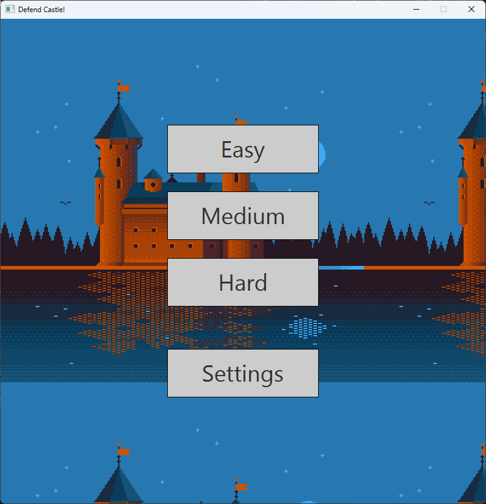
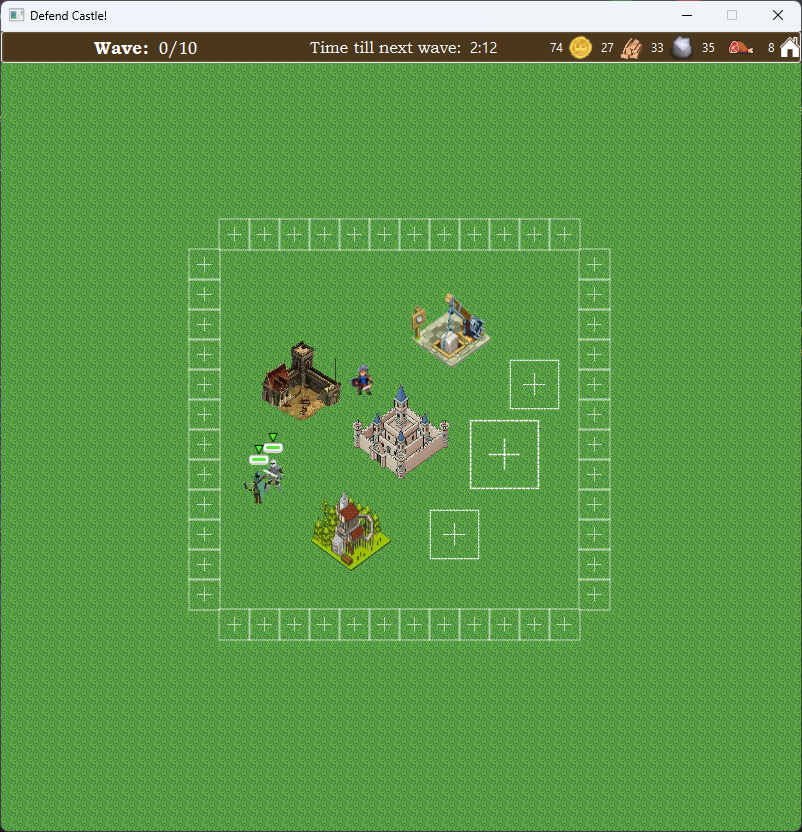

# 🏰 Defend Castle

> A RTS 2D Wave defence game built with Java and JavaFX UI library.

---

## 🖼️ Overview

Defend Castle is a 2D wave defense strategy game where the player must gather resources, build, and upgrade structures to survive increasingly difficult enemy waves.

Players can construct and upgrade buildings such as barracks, woodmills, quarries, walls, and the castle itself.
Resource-generating buildings like the woodmill and quarry automatically produce materials over time, while others like the barracks allow the player to train units for defense.

Between each enemy wave, players have a limited preparation phase to fortify their defenses. When the attack begins, enemies spawn and assault the player’s castle — if the castle falls, the game ends.

---

## 🧰 Tech Stack

**Other Tools:**

---

## 🎬 Showcase

### 🖼️ Screenshots
| Menu | Game |
|:--:|:--:|
|  |  |

<!--
### 🎥 Demo
> [🎞️ Watch the Demo Video](https://youtu.be/your-demo-link)  
or  
> 

*(Keep GIFs under ~5MB for faster loading.)*
-->
---

## 💡 Project Highlights

- ⚔️ Real-time 2D wave defense gameplay  
- 🏗️ Building & upgrade system with multiple structure types  
- 🌲 Resource generation (woodmill, quarry) and unit training (barracks)
- 💥 Simple NPC AI and wave system with progressive difficulty
- 🎞️ Simple sprite-based animations using JavaFX
- 🧭 Fully implemented game loop, input handling, and collision detection

---

## 🧭 The Process

1. **Game Design & Planning** – Defined core mechanics, resources, and building types.
2. **Rendering & Animation** – Implemented sprite-based animations with JavaFX Canvas.  
3. **Player & Enemy Systems** – Built movement, mining, attacking, and AI behaviors.  
4. **Wave & Timer System** – Added alternating build and attack phases.  
5. **Testing** – Ensured playability and performance.  

---

## 📚 What I Learned

- Game architecture and update loop design in Java
- Implementing 2D animation systems in JavaFX
- Structuring resource and economy systems for RTS games
- Designing simple AI for enemy behavior
- Managing performance and rendering optimization in JavaFX

---

## 🏁 Conclusion

Defend Castle combines strategy, resource management, and real-time combat into a compact and engaging 2D RTS experience.
It showcases both Java development skills and game design creativity, highlighting how complex systems like AI, animation, and resource management can be built using plain Java and JavaFX.

> 🕹️ Defend your castle, grow your empire, and survive the onslaught!
